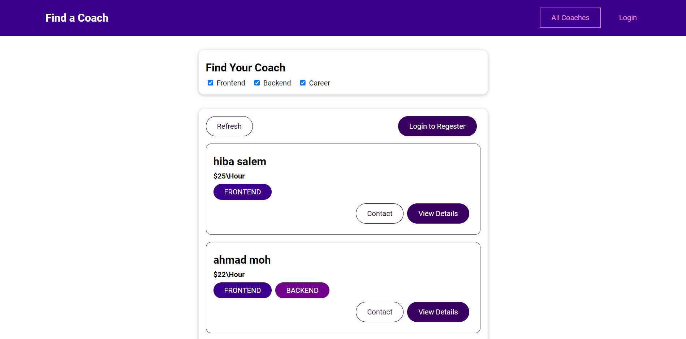

# Find a coach

this project is final project for vue.js course on udamy [link](https://www.udemy.com/course/vuejs-2-the-complete-guide/)

## Project description

- A frontend web app using vue.js, in which a user can check the available coaches and view their profiles , filter them and contact them also register as a coach and check their own requests.

[Deployment link](https://tidal-beacon-310418.web.app/coaches)  
[Watch demo here](https://www.youtube.com/watch?v=LzZXegdvriY)

## Auther

- Hiba Salem

## features

- View all , view profiles, contact coaches
- register and view personal requests
- cashing and loading screens
- Authentication

## Resources and Technologies

- Built with vue.js to communicate with a firebase realtime database utilizing vuex and vue.js features
